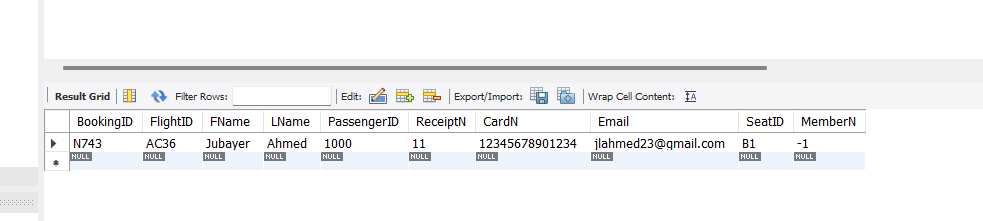

# Airline Ticketing System

## This is an airline ticketing app created using java. Tickets can be booked by guests or registered users. Admins can manage flights. Users can retrieve booking and cancel. Confirmation email is sent to user. Data is stored in MySQL database. 

## Screenshots

### Screenshot 1: Home Page

*Description: This is the home page of the Airline Ticketing System.*

### Screenshot 2: Guest Page

*Description: Guest login page.*

### Screenshot 3: Booking Confirmation

*Description: A confirmation page displaying details after a successful booking.*

### Screenshot 4: Email Confirmation

*Description: Users are notified via email.*

### Screenshot 5: Booking Retrieval

*Description: Users are notified via email.*

### Screenshot 6: Database Update

*Description: Users are notified via email.*
