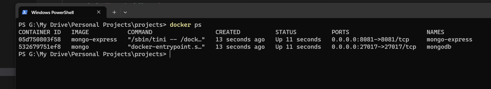
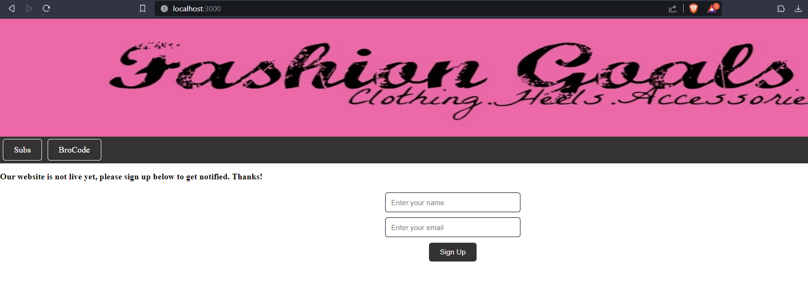
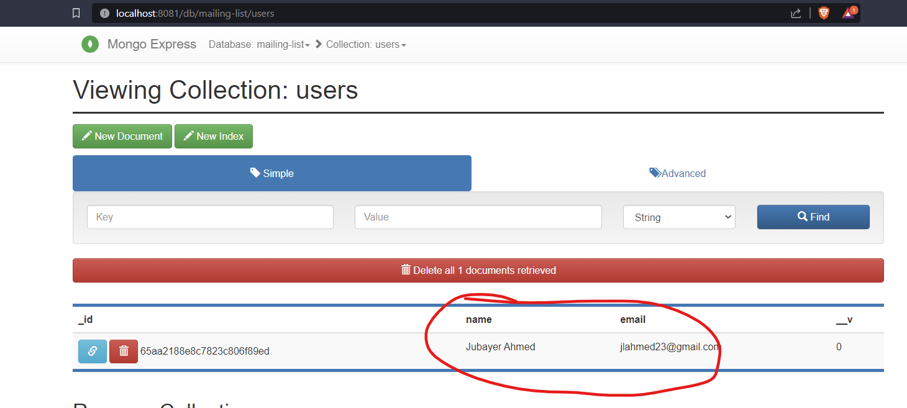

## Screenshots

### MongoDB and MongoExpress running in docker containers on same network

### Website

### Database updated based on website input
  

------------------------------------------------------------------------------

Instructions to run the project after download:
1. open folder in VS code
2. open docker
3. run: npm install
4. run this command: docker-compose up -d
5. run: nodemon app
6. go to localhost:8081
7. create database called: mailing-list
8. add collection called: users
9. go to localhost: 3000

to close, run: docker-compose down
